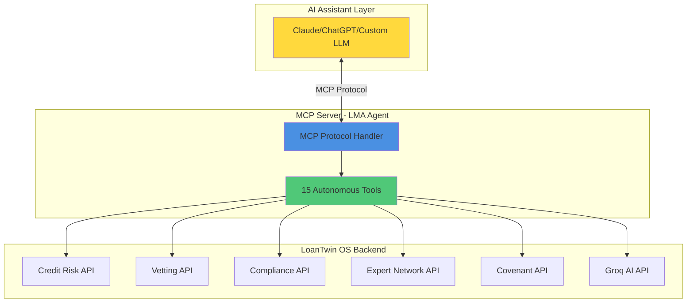

# MCP (Model Context Protocol) - Key Role & Expansion Opportunities

## Executive Summary

The **LMA Agent MCP Server** is a critical component of LoanTwin OS v4.0 that enables **autonomous AI-powered loan vetting** through the Model Context Protocol. It acts as an intelligent middleware layer that connects AI assistants (like Claude, ChatGPT, or custom LLMs) directly to LoanTwin OS's backend APIs, enabling natural language interactions with complex loan workflows.

---

## 🎯 Current MCP Implementation

### Architecture Overview



### 15 Autonomous MCP Tools

#### 1. Portfolio Management (3 tools)
- **`get_loan_applications`** - Retrieve applications with status/risk filters
- **`get_portfolio_summary`** - Portfolio-wide statistics and health metrics
- **`load_demo_portfolio`** - Load demo data for testing

#### 2. Risk Assessment (2 tools)
- **`assess_loan_risk`** - ML credit risk with SHAP explainability
- **`auto_triage_application`** - Auto-classify and route applications

#### 3. Document Verification (3 tools)
- **`check_document_completeness`** - Check required documents
- **`get_vetting_checklist`** - Complete document requirements
- **`verify_document`** - AI-powered authenticity verification

#### 4. Compliance (2 tools)
- **`run_compliance_check`** - KYC, AML, sanctions, credit bureau
- **`check_covenants`** - Covenant compliance status

#### 5. Expert Network (1 tool)
- **`recommend_expert`** - AI-powered expert matching

#### 6. Reporting (1 tool)
- **`generate_vetting_report`** - Comprehensive vetting reports

#### 7. Groq AI-Powered Tools (4 tools)
- **`ai_triage`** - Real-time triage (<100ms latency)
- **`ai_explain_risk`** - Human-readable risk explanations
- **`ai_classify_issue`** - Issue classification for expert routing
- **`ai_chat`** - Natural language LMA assistant

---

## 💡 Why MCP is Critical to LoanTwin OS

### 1. **Autonomous Agent Capabilities**
MCP transforms LoanTwin OS from a traditional web app into an **AI-native platform** where:
- Users can ask: *"Triage all pending applications and flag high-risk ones"*
- AI autonomously calls multiple tools: `get_loan_applications` → `assess_loan_risk` → `auto_triage_application`
- No manual clicking through UI required

### 2. **Natural Language Interface**
Instead of navigating complex UIs:
```
❌ Old Way: Login → Portfolio → Filter → Click Loan → Risk Tab → Assess → Documents Tab → Check
✅ MCP Way: "Generate a vetting report for loan #123 including risk and compliance"
```

### 3. **Workflow Orchestration**
MCP enables **multi-step autonomous workflows**:
```python
# Example: Auto-Vetting Workflow
1. get_loan_applications(status="pending")
2. For each application:
   - assess_loan_risk(app_id)
   - check_document_completeness(app_id)
   - run_compliance_check(app_id)
   - auto_triage_application(app_id)
3. generate_vetting_report(app_id)
```

### 4. **Integration with AI Assistants**
Works seamlessly with:
- **Claude** (Anthropic)
- **ChatGPT** (OpenAI)
- **Cursor IDE** (for developers)
- **Custom LLM agents**

---

## 🚀 Expansion Opportunities

### 1. **Secondary Market Trading MCP Tools** 🔥

**Gap**: No MCP tools for trade execution, marketplace, or settlement.

**Proposed Tools**:
```typescript
// Trade Preparation
- assess_trade_readiness(loan_id) → Check if loan is tradeable
- generate_trade_pack(loan_id) → Create due diligence package
- check_transfer_restrictions(loan_id) → Verify consent requirements

// Marketplace
- list_interested_buyers(loan_id) → Get pre-cleared buyers
- execute_trade(loan_id, buyer_id, price) → Execute trade
- request_consent_waiver(loan_id, buyer_id) → Request agent bank approval

// Market Intelligence
- get_distance_to_default(borrower_id) → Merton model credit risk
- get_market_pricing(loan_id) → Fair value estimate
```

**Use Case**:
```
User: "I want to sell loan #456. Is it ready for trading?"
AI: 
1. assess_trade_readiness(456) → Score: 85/100
2. check_transfer_restrictions(456) → Requires consent
3. list_interested_buyers(456) → 3 pre-cleared buyers
4. "Loan is trade-ready. 3 buyers interested. Consent required."
```

### 2. **Covenant Monitoring & Alerts** 🔥

**Gap**: Limited covenant tracking automation.

**Proposed Tools**:
```typescript
- monitor_covenant_breaches() → Real-time breach detection
- set_covenant_alert(loan_id, covenant_type, threshold) → Configure alerts
- generate_waiver_request(loan_id, covenant_id) → Auto-draft waiver
- track_covenant_history(loan_id) → Historical compliance
```

**Use Case**:
```
User: "Alert me if any loan breaches leverage covenant"
AI: set_covenant_alert(all_loans, "leverage", threshold=3.5)
→ Automated monitoring active
```

### 3. **Data Import & Bulk Operations** 🔥

**Gap**: No MCP tools for CSV import or bulk processing.

**Proposed Tools**:
```typescript
- import_loan_data(csv_url, mapping) → Import external data
- bulk_assess_risk(loan_ids[]) → Batch risk assessment
- bulk_generate_reports(loan_ids[]) → Mass report generation
- export_portfolio_data(format, filters) → Export to Excel/CSV
```

**Use Case**:
```
User: "Import this Lending Club CSV and assess all loans"
AI:
1. import_loan_data(url, auto_mapping)
2. bulk_assess_risk(imported_ids)
3. "Imported 500 loans, 50 high-risk flagged"
```

### 4. **Workflow Automation** 🔥

**Gap**: No workflow orchestration tools.

**Proposed Tools**:
```typescript
- create_workflow(name, steps[]) → Define custom workflow
- execute_workflow(workflow_id, loan_id) → Run workflow
- schedule_workflow(workflow_id, cron) → Scheduled execution
- get_workflow_status(execution_id) → Track progress
```

**Use Case**:
```
User: "Create a weekly compliance audit workflow"
AI: create_workflow("Weekly Audit", [
  run_compliance_check(all_loans),
  check_covenants(all_loans),
  generate_audit_report()
])
```

### 5. **Expert Network Engagement** 🔥

**Gap**: Expert recommendation exists, but no engagement tools.

**Proposed Tools**:
```typescript
- create_expert_issue(category, description) → Create issue
- draft_engagement_letter(expert_id, issue_id) → Auto-draft letter
- track_expert_engagement(engagement_id) → Status tracking
- rate_expert_performance(engagement_id, rating) → Feedback
```

**Use Case**:
```
User: "I need a legal expert for a syndicated loan dispute in NY"
AI:
1. recommend_expert("legal", "New York", "syndicated dispute")
2. create_expert_issue(category, description)
3. draft_engagement_letter(top_expert, issue_id)
4. "Engagement letter ready for review"
```

### 6. **AI Insights & Analytics** 🔥

**Gap**: Limited AI-powered analytics tools.

**Proposed Tools**:
```typescript
- ai_portfolio_insights() → AI-generated portfolio analysis
- ai_predict_defaults(timeframe) → Predictive default analysis
- ai_recommend_actions(loan_id) → Actionable recommendations
- ai_compare_loans(loan_ids[]) → Comparative analysis
```

**Use Case**:
```
User: "What are the biggest risks in my portfolio?"
AI: ai_portfolio_insights()
→ "3 loans with DTI >45%, 5 approaching covenant breach, 
   2 borrowers with declining credit scores"
```

### 7. **Document Intelligence** 🔥

**Gap**: No OCR or document extraction tools.

**Proposed Tools**:
```typescript
- extract_loan_terms(document_id) → OCR + AI extraction
- compare_documents(doc1_id, doc2_id) → Redline comparison
- detect_non_standard_clauses(loan_id) → LMA variance detection
- generate_clause_summary(clause_id) → AI clause explanation
```

**Use Case**:
```
User: "Extract all key terms from this credit agreement PDF"
AI: extract_loan_terms(doc_id)
→ Parties, Facility Amount, Interest Rate, Maturity, Covenants
```

---

## 📊 Impact Analysis

### Current MCP Tools: 15
### Proposed Additional Tools: 30+
### Total Potential: **45+ MCP Tools**

### Coverage Expansion

| Module | Current MCP Coverage | With Expansion |
|--------|---------------------|----------------|
| **Risk Assessment** | ✅ 100% | ✅ 100% |
| **Document Vetting** | ✅ 80% | ✅ 100% |
| **Compliance** | ✅ 70% | ✅ 100% |
| **Expert Network** | ⚠️ 30% | ✅ 100% |
| **Trading** | ❌ 0% | ✅ 100% |
| **Covenants** | ⚠️ 40% | ✅ 100% |
| **Data Import** | ❌ 0% | ✅ 100% |
| **Workflows** | ❌ 0% | ✅ 100% |
| **AI Analytics** | ⚠️ 50% | ✅ 100% |

---

## 🎯 Recommended Implementation Priority

### Phase 1: High-Impact Quick Wins (1-2 weeks)
1. **Trading Tools** - Massive value for secondary market
2. **Bulk Operations** - Essential for portfolio management
3. **Covenant Alerts** - Critical for compliance

### Phase 2: Workflow Automation (2-3 weeks)
4. **Workflow Tools** - Enable custom automation
5. **Expert Engagement** - Complete expert network loop

### Phase 3: Advanced Analytics (3-4 weeks)
6. **AI Analytics** - Predictive insights
7. **Document Intelligence** - OCR + extraction

---

## 💼 Business Value

### For Credit Analysts
- **Before MCP**: 30 min to assess one loan
- **With MCP**: "Assess all 50 pending loans" → 2 minutes

### For Loan Operations
- **Before MCP**: Manual document tracking
- **With MCP**: "Alert me when any loan is missing documents" → Automated

### For Traders
- **Before MCP**: Hours to prepare trade pack
- **With MCP**: "Generate trade pack for loan #123" → 30 seconds

### For Compliance Officers
- **Before MCP**: Weekly manual audits
- **With MCP**: "Run weekly compliance audit" → Scheduled automation

---

## 🔧 Technical Implementation

### Adding a New MCP Tool (Example)

```python
# In mcp-lma-agent/src/server.py

@server.list_tools()
async def list_tools() -> List[Tool]:
    return [
        # ... existing tools ...
        Tool(
            name="assess_trade_readiness",
            description="Check if a loan is ready for secondary market trading",
            inputSchema={
                "type": "object",
                "properties": {
                    "loan_id": {
                        "type": "integer",
                        "description": "The ID of the loan to assess"
                    }
                },
                "required": ["loan_id"]
            }
        )
    ]

async def assess_trade_readiness(args: Dict) -> Dict:
    """Check trade readiness for a loan."""
    loan_id = args["loan_id"]
    result = await api_call("GET", f"/trade-pack/{loan_id}")
    
    if "error" not in result:
        score = result.get("trade_readiness_score", 0)
        result["interpretation"] = {
            "ready": score >= 80,
            "blockers": result.get("blocking_issues", []),
            "recommendation": "Proceed" if score >= 80 else "Remediate"
        }
    
    return result
```

---

## 📈 Success Metrics

### Adoption Metrics
- **Tool Usage**: Track calls per tool per day
- **Workflow Completion**: % of tasks completed via MCP vs UI
- **Time Savings**: Average time per task (MCP vs manual)

### Business Metrics
- **Vetting Throughput**: Applications processed per day
- **Risk Detection**: % of high-risk loans flagged early
- **Compliance Rate**: % of loans meeting all requirements

---

## 🎓 User Training & Adoption

### Example Prompts for Users

**Credit Analyst**:
```
"Show me all loans with risk score >70 and missing documents"
"Generate vetting reports for loans #100-150"
"What are the top 5 risk factors in my portfolio?"
```

**Trader**:
```
"Is loan #456 ready to trade?"
"Find pre-cleared buyers for loan #789"
"Generate trade pack for loan #123"
```

**Compliance Officer**:
```
"Run KYC and AML checks on all pending applications"
"Alert me if any loan breaches covenants"
"Generate monthly compliance audit report"
```

---

## 🔐 Security Considerations

- **API Authentication**: All MCP tools use authenticated API calls
- **Rate Limiting**: Prevent abuse with request throttling
- **Audit Logging**: Track all MCP tool executions
- **Role-Based Access**: Restrict tools based on user permissions

---

## 🚀 Conclusion

**MCP is the key differentiator** that transforms LoanTwin OS from a traditional loan management system into an **AI-native autonomous platform**. 

With the proposed expansions, LoanTwin OS will offer:
- **45+ autonomous tools** covering every workflow
- **Natural language interface** for all operations
- **Workflow automation** without coding
- **Real-time AI insights** powered by Groq

This positions LoanTwin OS as the **most advanced AI-powered loan platform** in the market.
