# LoanTwin OS

> **AI-Powered Loan Document Intelligence Platform**  
> Transform complex loan agreements into actionable digital insights

LoanTwin OS turns long-form loan agreements (PDF) into:
- **Digital Loan Record (DLR)** - Structured JSON with AI-extracted metadata
- **Clause Explorer** - Intelligent search with page-level citations
- **Obligation Calendar** - Automated compliance tracking with due dates
- **Secondary Trade Due Diligence Pack** - Risk assessment and transferability analysis

---

## 🌐 Live Demo (Google Cloud Run)

**🚀 Production Deployment**

- **Frontend Application**: [https://loantwin-frontend-fozkypxpga-uc.a.run.app](https://loantwin-frontend-fozkypxpga-uc.a.run.app)
- **Backend API**: [https://loantwin-backend-fozkypxpga-uc.a.run.app](https://loantwin-backend-fozkypxpga-uc.a.run.app)
- **API Documentation (Swagger)**: [https://loantwin-backend-fozkypxpga-uc.a.run.app/docs](https://loantwin-backend-fozkypxpga-uc.a.run.app/docs)
- **Health Check**: [https://loantwin-backend-fozkypxpga-uc.a.run.app/api/health](https://loantwin-backend-fozkypxpga-uc.a.run.app/api/health)

**Deployment Details:**
- Platform: Google Cloud Run
- Region: us-central1
- Backend Memory: 1Gi (optimized for AI document processing)
- Auto-scaling enabled
- HTTPS with Google-managed certificates

---

## 🏗️ System Architecture

### Complete End-to-End Flow

```mermaid
graph TB
    subgraph "Client Layer"
        USER[👤 User Browser]
    end
    
    subgraph "Frontend - Next.js 14"
        UI[React UI Components]
        API_CLIENT[API Client Layer]
        PAGES[Pages: Workspace/DLR/Clauses/Obligations/Trade Pack]
    end
    
    subgraph "Backend - FastAPI"
        ROUTER[API Routers]
        SERVICES[Document Processing Services]
        EXTRACTOR[AI Legal Extractor]
        DB_LAYER[SQLModel ORM]
    end
    
    subgraph "Data Layer"
        SQLITE[(SQLite Database)]
        FILES[PDF Storage]
    end
    
    subgraph "AI Processing Pipeline"
        PDF_PARSE[PyMuPDF Parser]
        NLP[Legal NLP Engine]
        CLAUSE_DETECT[Clause Detection]
        METADATA_EXTRACT[Metadata Extraction]
    end
    
    USER -->|HTTP/3005| UI
    UI --> API_CLIENT
    API_CLIENT -->|REST API/8005| ROUTER
    ROUTER --> SERVICES
    SERVICES --> EXTRACTOR
    EXTRACTOR --> PDF_PARSE
    PDF_PARSE --> NLP
    NLP --> CLAUSE_DETECT
    NLP --> METADATA_EXTRACT
    SERVICES --> DB_LAYER
    DB_LAYER --> SQLITE
    SERVICES --> FILES
    
    style USER fill:#4A90E2
    style UI fill:#50C878
    style ROUTER fill:#FF6B6B
    style EXTRACTOR fill:#FFD93D
    style SQLITE fill:#A8DADC
```



---

## 🎨 Frontend Architecture

### Technology Stack
- **Framework**: Next.js 14 (App Router)
- **Language**: TypeScript
- **Styling**: CSS Variables + Modern CSS
- **State Management**: React Hooks
- **API Communication**: Fetch API

### Component Structure


### Key Features
- **Multi-Document Upload**: Drag-and-drop interface with progress tracking
- **Real-time Processing**: Live status updates during AI extraction
- **Intelligent Search**: Full-text search across clauses with highlighting
- **Responsive Design**: Mobile-first approach with adaptive layouts
- **Dark Mode Ready**: CSS variable-based theming

---

## ⚙️ Backend Architecture

### Technology Stack
- **Framework**: FastAPI 0.115.6
- **ORM**: SQLModel 0.0.22
- **Database**: SQLite (production-ready with migrations)
- **PDF Processing**: PyMuPDF (fitz) 1.24.10
- **Server**: Uvicorn with async support

### Service Architecture


### Database Schema


### AI Processing Pipeline

The Legal Extractor uses advanced NLP patterns to:
1. **Parse PDF Structure**: Extract text with page-level precision
2. **Detect Clauses**: Identify numbered sections and headings using regex patterns
3. **Extract Metadata**: 
   - Governing law detection (New York, Delaware, England, etc.)
   - Agreement dates and parties
   - Currency and facility information
4. **Analyze Transferability**: Detect assignment provisions and consent requirements
5. **Extract Covenants**: Identify financial and operational covenants
6. **Generate Obligations**: Create compliance calendar with due dates
7. **Risk Assessment**: Build trade pack with transferability analysis

---

## 🧪 Testing Architecture

LoanTwin OS includes a comprehensive testing suite with 100% backend test coverage and E2E testing with Playwright.


### Test Coverage

**Backend (28/28 tests passing - 100%)**
- Unit Tests: Loans router, health checks
- API Tests: Endpoint validation, error handling
- Integration Tests: DLR workflow, Expert Network
- Smoke Tests: Critical paths, CORS, health

**Frontend (23/23 Jest tests + 8 Playwright E2E)**
- Unit Tests: API client functionality
- Integration Tests: DLR workflow, Obligations
- Smoke Tests: Page loads, navigation
- E2E Tests: Full user journeys with Playwright

**Running Tests:**
```bash
# Backend
cd backend && pytest -v

# Frontend Unit/Integration
cd frontend && npm test

# Frontend E2E
cd frontend && npm run test:e2e

# All tests
./scripts/run-all-tests.sh
```

See [TESTING.md](TESTING.md) for detailed testing documentation.

---

## 🚀 Quick Start

### Prerequisites
- Docker & Docker Compose
- 4GB RAM minimum
- Modern web browser

### Installation

```bash
# Clone the repository
git clone https://github.com/samalpartha/LoanTwinOS_E2E.git
cd LoanTwinOS_E2E

# Start the application
docker compose up --build
```

### Access Points
- **Frontend**: http://localhost:3005
- **Backend API**: http://localhost:8005
- **API Health Check**: http://localhost:8005/api/health
- **API Docs (Swagger)**: http://localhost:8005/docs

---

## 📋 Demo Workflow

### 1. Create Loan Workspace
```bash
POST /api/loans
{
  "name": "Boeing Credit Agreement 2024"
}
```

### 2. Upload Documents
- Drag & drop PDF files (Credit Agreement, Side Letters, Amendments)
- Multi-file support for comprehensive deal analysis

### 3. Process Documents
- AI extracts clauses, obligations, and metadata
- Generates Digital Loan Record (DLR)
- Creates compliance calendar

### 4. Explore Results
- **DLR Analysis**: View structured deal data with AI confidence scores
- **Clause Explorer**: Search and navigate agreement sections
- **Obligations**: Track reporting requirements and deadlines
- **Trade Pack**: Review transferability and risk factors

---

## 🔌 Key API Endpoints

### Loan Management
```
POST   /api/loans                              # Create new loan
POST   /api/loans/sample                       # Load sample data
GET    /api/loans/{loanId}                     # Get loan details
GET    /api/loans/{loanId}/dlr                 # Get Digital Loan Record
```

### Document Processing
```
POST   /api/loans/{loanId}/documents           # Upload document
POST   /api/loans/{loanId}/process-document/{documentId}  # Process with AI
GET    /api/loans/{loanId}/documents           # List documents
```

### Analysis & Search
```
GET    /api/loans/{loanId}/clauses?query=...   # Search clauses
GET    /api/loans/{loanId}/obligations         # Get compliance calendar
GET    /api/loans/{loanId}/trade-pack          # Get due diligence pack
```

### Authentication
```
POST   /api/auth/register                      # User registration
POST   /api/auth/login                         # User login
POST   /api/auth/social-login                  # OAuth login
```

---

## 🛠️ Technology Stack Summary

| Layer | Technology | Purpose |
|-------|-----------|---------|
| **Frontend** | Next.js 14 | React framework with App Router |
| **UI Language** | TypeScript | Type-safe development |
| **Styling** | CSS Variables | Modern, themeable design system |
| **Backend** | FastAPI | High-performance async API |
| **ORM** | SQLModel | Type-safe database operations |
| **Database** | SQLite | Embedded relational database |
| **PDF Processing** | PyMuPDF | Fast PDF parsing and text extraction |
| **AI/NLP** | Custom Regex + Pattern Matching | Legal document intelligence |
| **Containerization** | Docker Compose | Multi-service orchestration |
| **API Docs** | OpenAPI/Swagger | Auto-generated API documentation |

---

## 📊 Features

### ✅ Core Capabilities
- [x] Multi-document PDF upload and processing
- [x] AI-powered clause extraction with page references
- [x] Automated obligation calendar generation
- [x] Transferability and risk analysis
- [x] Full-text search across all clauses
- [x] Digital Loan Record (DLR) generation
- [x] User authentication and authorization
- [x] Sample data for quick demos
- [x] Responsive web interface
- [x] RESTful API with OpenAPI documentation

### 🔮 Advanced Features
- Confidence scoring for AI extractions
- Cross-document reference detection
- Covenant compliance tracking
- Secondary market due diligence automation
- Audit logging for all operations

---

## 📝 License

This project is part of a hackathon submission and is provided as-is for demonstration purposes.

---

## 👥 Team

**Architecture & Development**: Enterprise-grade loan document intelligence platform

---

## 🔗 Links

- **Repository**: https://github.com/samalpartha/LoanTwinOS_E2E
- **Live Frontend**: https://loantwin-frontend-fozkypxpga-uc.a.run.app
- **Live API**: https://loantwin-backend-fozkypxpga-uc.a.run.app
- **API Documentation**: https://loantwin-backend-fozkypxpga-uc.a.run.app/docs
- **Local Frontend** (after docker compose up): http://localhost:3005
- **Local API** (after docker compose up): http://localhost:8005

